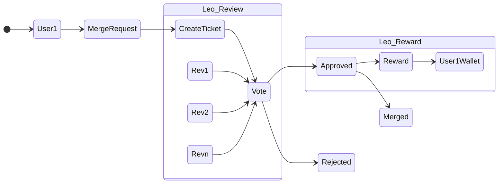

# privateReward

```mermaid
stateDiagram
    direction LR
    [*] --> User1
    User1 --> MergeRequest
    MergeRequest --> CreateTicket
    state Leo_Review {
      CreateTicket --> Vote
      direction RL
      Rev1 --> Vote
      Rev2 --> Vote
      Revn --> Vote
    }
    Vote --> Approved
    Vote --> Rejected
    state Leo_Reward {
      Approved --> Reward
      Reward --> User1Wallet
    }
    Approved --> Merged
```

## LEO REVIEW

A voting system

## LEO REWARD

Simple Token 

## TODO

An overall system to orchestrate the review and the reward systems
