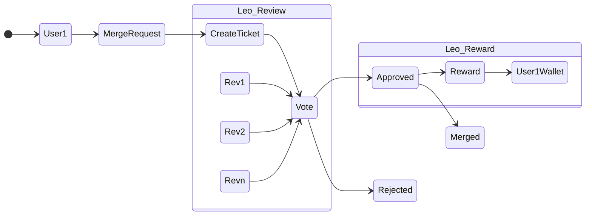

# Private Reward

A privacy protecting system to allow all the contributors to freely support the projects they want, regardless of companies they work for, place where they live, ...




## Create Ticket 
```
Ticket {
    Id : (ZKP?) Id of the User,
    MergeReq : URL with the hash of the Merge Reqeust,
    Wallet : wallet address for the reward
}
```

## LEO REVIEW

A voting system

## LEO REWARD

Simple Token 

## TODO

An overall system to orchestrate the review and the reward systems
